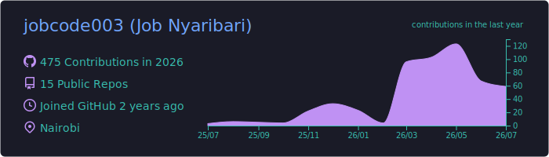

 

 

---

## Professional Summary

I am an AI/ML engineer who builds **production-grade intelligent systems**, not isolated notebooks. My work spans computer vision, retrieval-augmented generation (RAG), multi-agent orchestration, and full-stack application development, with a consistent focus on real-world deployment in resource-constrained environments.

I have architected and delivered platforms in telemedicine, precision agriculture, algorithmic trading, legal research, and gig-economy marketplaces — often as a lead builder, and in collaborative settings such as the **Kenya AI Challenge** and the **HakiChain** legal-tech internship.

**Core competencies:** AI system design · RAG & LLM orchestration · Computer vision · Full-stack development (Python/Django/FastAPI + React/Next.js) · IoT edge integration · CI/CD & cloud deployment

---

## GitHub Analytics

 

 

 

---

## Featured Work

### AfyaSync — AI-Powered Telemedicine Platform
A unified remote healthcare ecosystem connecting patients, clinicians, and hospitals through secure digital workflows.

- **Stack:** Django · React · FastAPI · LangChain/LangGraph · Qdrant · PostgreSQL
- **Highlights:** Video consultations, electronic medical records, RAG-based clinical triage, M-Pesa payment integration, ESP32 IoT vital-signs ingestion
- **Status:** Active development
- **Repository:** [AfyaSync](https://github.com/jobcode003/AfyaSync)

---

### AgriScan — Agricultural Intelligence Platform
An end-to-end agritech platform that combines crop disease diagnosis, multilingual AI advisory, and a role-based farmer marketplace.

- **Stack:** Django · TensorFlow (EfficientNetB0 / MobileNetV2) · LangChain · ChromaDB · CapacitorJS
- **Highlights:** Multi-crop vision models with OOD gatekeeping, AgriBot assistant (English & Kiswahili), Farm Health Score for micro-lending eligibility
- **Status:** Deployed on Railway
- **Repository:** [crop_AI_analyzer](https://github.com/jobcode003/crop_AI_analyzer)

---

### AnyHustle — AI-Powered Gig & Job Marketplace
Kenya's all-in-one work platform bridging formal employment, freelance tasks, domestic work, and local physical gigs.

- **Stack:** Django REST Framework · Next.js · LLM-powered matching & moderation
- **Highlights:** Structured job posting, AI talent matching, escrow payments via M-Pesa, trust-and-safety content screening, mobile-first architecture
- **Status:** Active development
- **Repository:** [AnyHustle](https://github.com/jobcode003/AnyHustle)

---

### HakiChain — Legal Services Platform
*Software Engineering Intern · HakiLens*

A modern legal-technology suite for Kenyan legal professionals, combining AI tooling with blockchain-backed document integrity.

- **Stack:** React 18 · TypeScript · Vite · Supabase · Ethers.js · Multi-provider LLM layer
- **My contribution — HakiLens:** AI legal research assistant featuring Kenya Law retrieval, citation-grounded responses, intent classification, and a hierarchical RAG pipeline
- **Status:** In development
- **Repository:** [hakichain-demo-suite](https://github.com/HakiChain-Main/hakichain-demo-suite)

---

### Kenya Constitution RAG — Legal Q&A Assistant
A grounded legal assistant that answers constitutional questions with verifiable source citations.

- **Stack:** Django · LangChain · ChromaDB · Groq (Llama 3.3)
- **Highlights:** Document ingestion pipeline, semantic retrieval over the Constitution of Kenya, citation-backed chat interface
- **Repository:** [langrag](https://github.com/jobcode003/langrag)

---

### Archweave — AI System Design Studio
Transforms natural-language system descriptions into complete architecture specifications, diagrams, and agent-ready implementation documents.

- **Stack:** Next.js 15 · TypeScript · Tailwind CSS · OpenAI API · Mermaid.js
- **Highlights:** C4, ER, sequence, and deployment diagram generation; structured markdown export optimized for AI coding agents (Cursor, Copilot)
- **Repository:** [archweave](https://github.com/jobcode003/archweave)

---

### SokoSense — Farmer Decision Engine
*Collaborator · Team of 4 · Kenya AI Challenge 2026 · AgriFin Track*

Converts raw agricultural market data into concise, actionable instructions for Kenyan smallholder farmers via SMS, USSD, and web.

- **Stack:** FastAPI · LangGraph · React/Vite · Rule-based decision engines · Africa's Talking
- **Highlights:** KAMIS market-price agent, sell-timing and loan-risk engines, ≤320-character SMS decision delivery
- **Repository:** [SokoSense](https://github.com/Sophie-Muchiri12/SokoSense)

---

### TradeAI — Multi-Asset AI Trading Platform
A modular trading intelligence platform spanning forex, cryptocurrency, and equities with multi-agent analysis and sector-specific microservices.

- **Stack:** FastAPI · Next.js · PostgreSQL · Redis · TensorFlow LSTM · XGBoost · ChromaDB
- **Highlights:** Three-tier agent orchestrator, adversarial debate on split signals, live WebSocket feeds, walk-forward backtesting, paper and live execution routing
- **Status:** Active development
- **Repository:** [TradeAI](https://github.com/jobcode003/TradeAI)

---

### sllm — Small Local Language Model
A resource-efficient pipeline for training and evaluating compact word-level language models on single-document corpora using consumer-grade hardware.

- **Stack:** PyTorch · TensorFlow/Keras (optional) · Custom word-level tokenizer
- **Highlights:** PDF-to-text extraction, low-RAM CPU training configs, validation/test evaluation suite
- **Status:** Independent research project

---

### Portfolio Website
A responsive personal portfolio presenting project work, technical skills, and professional contact information.

- **Stack:** HTML5 · CSS3 · JavaScript
- **Live site:** [nyaribarijob.netlify.app](https://nyaribarijob.netlify.app/)
- **Repository:** [myportfolio](https://github.com/jobcode003/myportfolio)

---

## Tech Stack

### Languages

### ML & AI

### Backend & Data

### Frontend

### DevOps & Cloud

---

## How I Work

- **Systems over demos** — Every project is designed with deployment, maintainability, and real users in mind.
- **Grounded AI** — RAG pipelines, evaluation metrics, and citation tracing over unverifiable model outputs.
- **Right-sized architecture** — Monoliths where they fit; microservices and agent layers where scale demands it.
- **Automation from day one** — CI/CD, containerization, and reproducible environments as baseline practice.
- **Domain-first engineering** — Technology choices driven by the problem — whether that is a farmer in Nakuru, a clinician in a rural clinic, or a trader monitoring forex pairs.

---

## Current Focus

- Multi-agent AI orchestration for trading, legal research, and agricultural advisory
- Telemedicine platforms with IoT-based remote patient monitoring
- RAG systems with jurisdiction-aware retrieval and source grounding
- AgriFin decision engines for smallholder farmers in East Africa
- Workforce platforms with AI-assisted matching and trust infrastructure

---

## Contribution Graph

<picture>
  <source media="(prefers-color-scheme: dark)" srcset="https://raw.githubusercontent.com/jobcode003/jobcode003/output/github-snake-dark.svg">
  <source media="(prefers-color-scheme: light)" srcset="https://raw.githubusercontent.com/jobcode003/jobcode003/output/github-snake.svg">
  
</picture>

---

## Open To

- Full-time and contract roles in ML/AI engineering
- Research and open-source collaborations
- Technical mentoring and knowledge sharing
- Early-stage startup partnerships

---

## Connect

---

**Thanks for visiting!**

*Last updated: July 2026*

